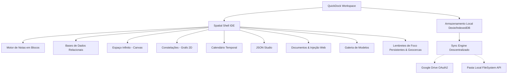
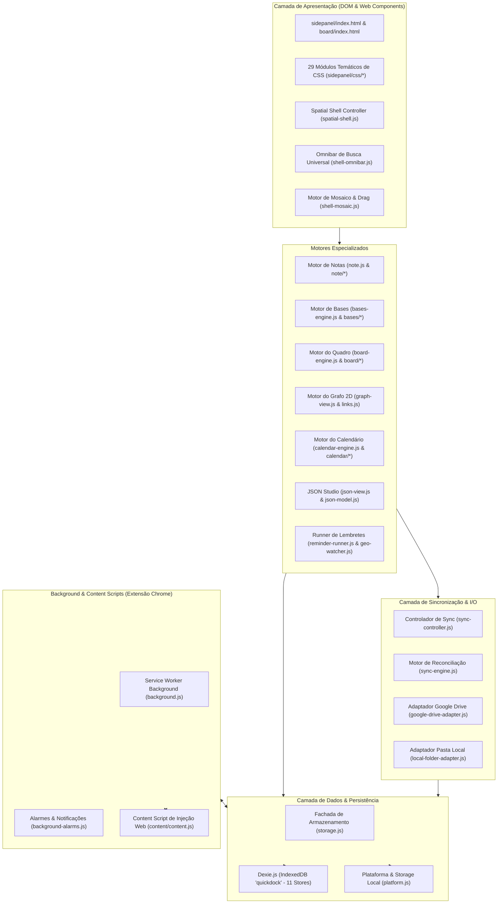
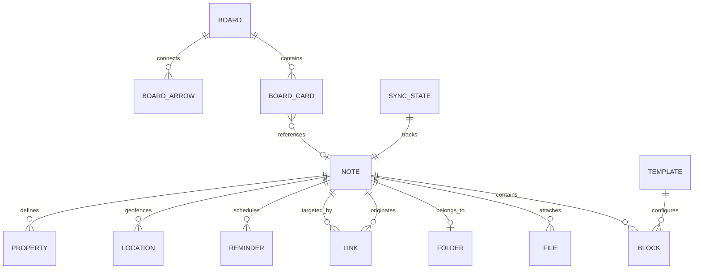
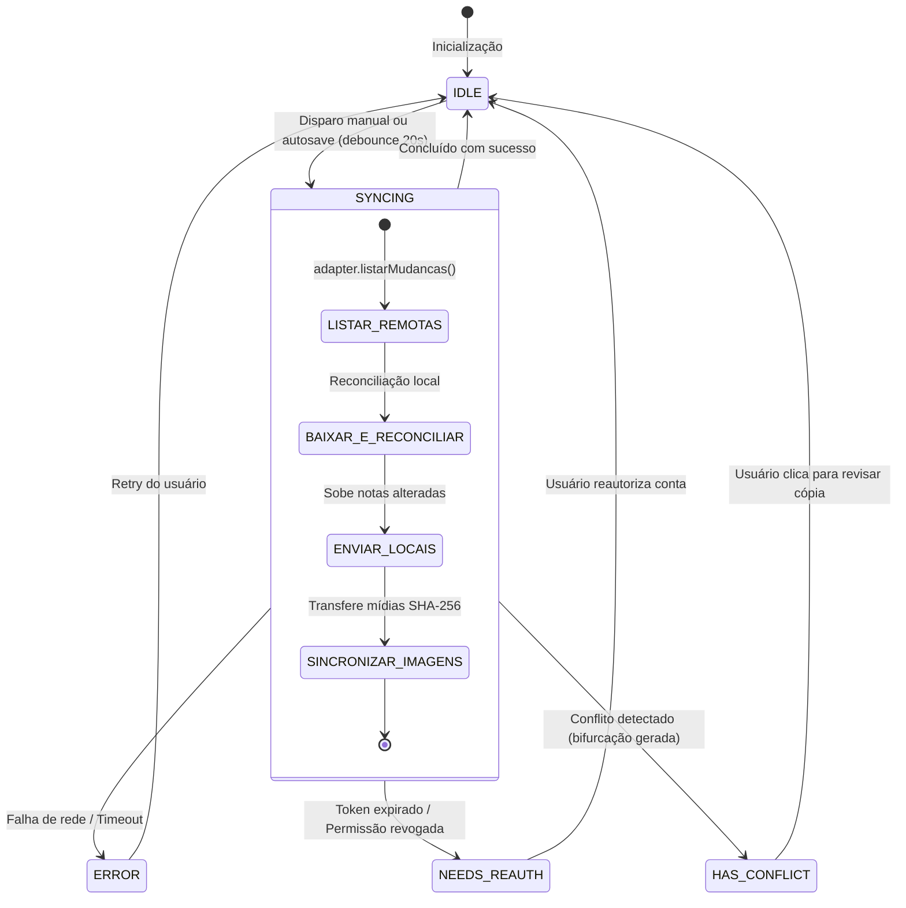
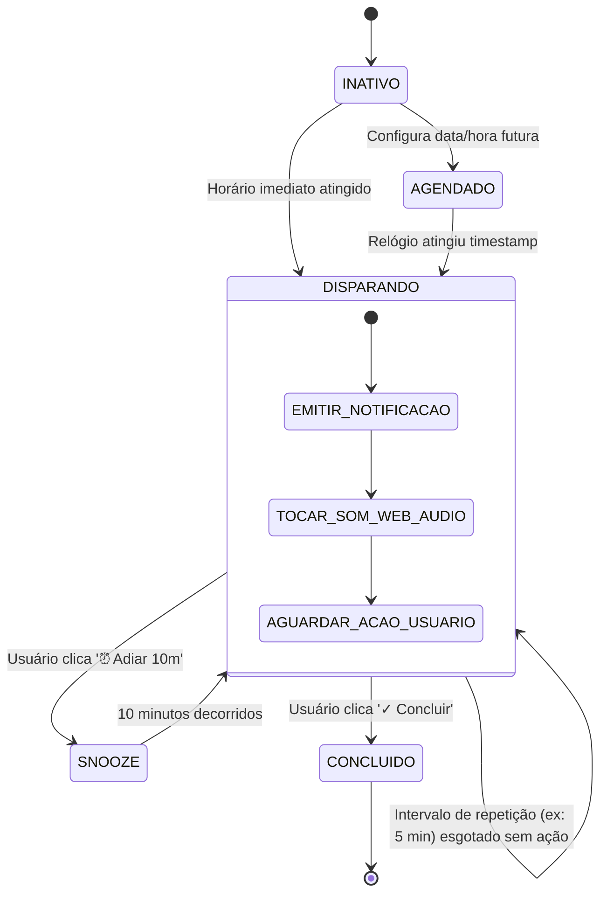
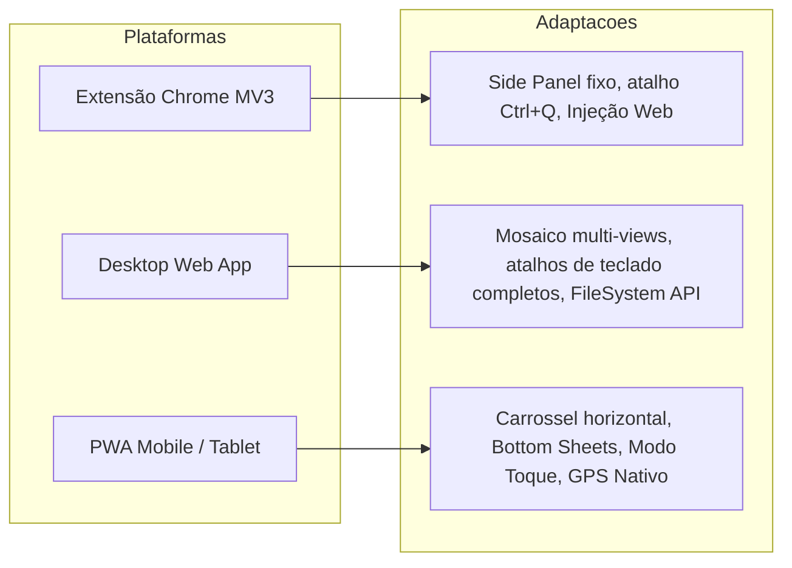
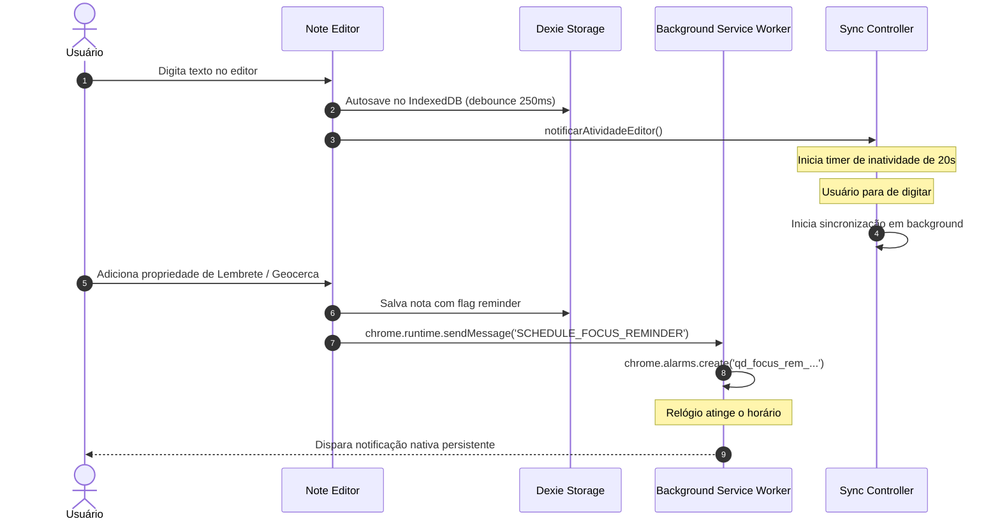

# PRD — QuickDock (Product Requirements Document)
**Documento de Especificação e Engenharia Reversa Completa do Produto**  
**Versão do Produto:** 2.1.0 (Extensão Chrome) / 3.0.0 (Spatial Shell & PWA)  
**Data de Emissão:** Outubro de 2026  
**Status do Documento:** Aprovado / Engenharia Reversa Concluída  
**Classificação:** Referência Técnica e Funcional Definitiva  

---

## 1. Visão Geral

O **QuickDock** é um workspace lateral persistente e espacial de alta performance projetado para produtividade operacional, gestão de conhecimento pessoal (PKM), estruturação de dados em tabelas dinâmicas, ideação livre em telas infinitas e execução de tarefas com suporte a Lembretes de Foco Persistentes e Geocercas.

O produto opera sob o paradigma arquitetural **Local-First (Zero-Server)**: todos os dados, notas, arquivos, esquemas de bases de dados, configurações e históricos residem estritamente no armazenamento local do navegador do usuário (IndexedDB via Dexie.js e chrome.storage). O aplicativo não possui servidores proprietários de banco de dados, telemetria ou processamento intermediário.

Para colaboração entre dispositivos e backup de segurança, o QuickDock oferece uma camada de reconciliação de sincronização descentralizada ponto a ponto (Google Drive via escopo restrito `drive.file` ou Sistema de Arquivos Local via File System Access API), utilizando arquivos abertos em Markdown padronizado com Frontmatter YAML e pastas de mídias referenciadas por hash SHA-256.

O QuickDock combina o poder de editores estruturados baseados em blocos, a flexibilidade de bases de dados relacionais e visões dinâmicas, a espacialidade de quadros brancos infinitos, a visualização conexionista de grafos de conhecimento, um estúdio de análise e criação de JSON, um calendário temporal bidirecional e um motor de geocercas e alarmes persistentes de foco.



---

## 2. Objetivo do Produto

O objetivo primário do QuickDock é eliminar a fricção entre a navegação cotidiana na web, a execução de tarefas corporativas operacionais e a retenção de dados estruturados.

Ao contrário de soluções que exigem a troca constante de janelas (`Alt + Tab`), abas de terceiros pesadas ou logins em SaaS corporativos lentos, o QuickDock:
1. **Vive ao lado do trabalho:** Funciona no Painel Lateral nativo do Google Chrome (Side Panel) aberto permanentemente com atalho de teclado instantâneo (`Ctrl + Q`), em aba dedicada ou como aplicativo PWA instalável no desktop e mobile.
2. **Preserva a autonomia e soberania dos dados:** Garante que os arquivos pertençam 100% ao usuário em formatos não-proprietários (`.md`, `.json`, `.png`, `.jpg`), sem aprisionamento tecnológico (*vendor lock-in*).
3. **Oferece velocidade instantânea (0 ms de latência):** Todas as operações de digitação, busca universal (`Ctrl + K`), cálculos aritméticos inline e renderização de tabelas acontecem localmente na memória RAM e no IndexedDB da máquina.
4. **Protege a atenção de usuários neurodivergentes:** Combina lembretes persistentes com sons sintetizados in-app e geocercas baseadas em localização GPS física, rompendo a "cegueira temporal" e garantindo que prazos críticos sejam cumpridos.

---

## 3. Problemas Resolvidos

| Problema Encontrado | Como o QuickDock Resolve | Evidência no Código |
|---|---|---|
| **Alternância constante de abas e perda de foco (Context Switching)** | Fixação do workspace no Side Panel do Chrome, operando em paralelo à navegação ativa sem sobrepor o conteúdo da página. | `manifest.json` (`side_panel`), `background.js` |
| **Insegurança de dados corporativos e privacidade em nuvens públicas** | Arquitetura Zero-Server: nenhum dado sai da máquina do usuário a menos que a sincronização seja explicitamente ativada para uma pasta própria. | `privacidade.html`, `storage.js` |
| **Lentidão em planilhas e formulários web corporativos** | Detecção inteligente instantânea de dados brasileiros (CPF, CNPJ, CEP, Telefone, Datas) com 1 clique para formatar/desformatar e injeção automática em formulários web. | `note-detection.js`, `content/content.js` |
| **Formatação quebrada ao copiar e colar do Excel** | Parser dedicado embutido de TSV/Clipboard que converte tabelas coladas de planilhas diretamente em tabelas interativas ricas sem quebrar a nota. | `note-table.js` (`parseSpreadsheetPaste`) |
| **Perda de arquivos anexados e imagens ao exportar** | Imagens salvas como Blobs locais independentes; na exportação, são embutidas em DataURL Base64 autônomos ou pastas relativas `imagens/<hash>.ext`. | `blocks.js` (`blocksToMarkdownForExport`), `sync-engine.js` |
| **Gestão de prioridades críticas e combate ao esquecimento (Foco Persistente)** | Notificações do sistema persistentes com loop repetitivo ininterrupto a cada N minutos até ação explícita de "Concluir" ou "Adiar 10m", além de alarmes ao entrar/sair de raio geográfico. | `background-alarms.js`, `persistent-reminder.js`, `location-service.js` |
| **Conflitos de edição concorrente em múltiplos dispositivos** | Algoritmo de ordem fracionária (`a0`, `a1`, `b10`) e bifurcação determinística não-destrutiva de notas conflitantes preservando ambas as versões. | `storage.js` (`ordemEntre`), `sync-engine.js` |
| **Inspeção e manipulação penosa de payloads JSON** | JSON Studio com visualizador em árvore com busca de nós, editor de texto com linha do erro exata, conversor bidirecional de tipos e minificador. | `json-view.js`, `json-model.js` |

---

## 4. Público e Perfis de Usuário

O QuickDock foi construído para atender quatro perfis operacionais principais:

### 4.1. Operador / Analista Corporativo (Backoffice & Atendimento)
- **Perfil:** Usuário que atua em sistemas web corporativos legados, conferindo cadastros, preenchendo contratos e consultando dados cadastrais.
- **Necessidades:** Cópia rápida de CPFs/CNPJs com ou sem máscara, envio de comprovantes em formulários, conferência de idade via data de nascimento, cálculo rápido de comissões/juros/descontos em reais (BRL).
- **Recursos Chave:** Detecção inteligente (`note-detection.js`), injeção de arquivos na página ativa (`content.js`), folha de cálculo inline (`calc.js`).

### 4.2. Usuário de Alta Intensidade / Foco Prioritário
- **Perfil:** Profissional com rotina intensa, múltiplos prazos simultâneos e necessidade de mitigação de dispersão.
- **Necessidades:** Lembretes que não desaparecem silenciosamente após 3 segundos; avisos territoriais ao sair do escritório ou chegar a um cliente.
- **Recursos Chave:** Lembrete de foco persistente (`background-alarms.js`, `persistent-reminder.js`), Geocercas com raio configurável no mapa (`map-picker.js`), feedback auditivo sintetizado (`reminder-sound.js`).

### 4.3. Construtor de Conhecimento / Pesquisador (PKM / Obsidian Fans)
- **Perfil:** Estudante, pesquisador ou engenheiro que conecta ideias complexas, notas conceituais e documentação técnica.
- **Necessidades:** Links bidirecionais estilo wikilink (`[[Nota]]`), sumário estruturado para notas longas (Outline), visualização topológica do conhecimento (Grafo) e suporte a sintaxe Markdown Live Preview.
- **Recursos Chave:** Grafo 2D (`graph-view.js`), Wikilinks e Backlinks reversos (`links.js`, `note-backlinks.js`), Outline (`note-outline.js`).

### 4.4. Desenvolvedor / Analista Técnico
- **Perfil:** Engenheiro de software, tester ou analista de dados que consome APIs, manipula configurações e precisa debugar payloads estruturados.
- **Necessidades:** Validação sintática de JSON com apontamento de erro em tempo real, árvore visual navegável, templates de contratos e API mocks, além de diagramas de arquitetura e fluxogramas.
- **Recursos Chave:** JSON Studio (`json-view.js`), Formas de Fluxograma no Espaço Infinito (`board-shapes.js`, `board-arrows.js`), Blocos de código syntax-ready.

---

## 5. Áreas Atendidas

1. **Gestão de Tarefas e Execução Operacional:** Backlog, checklists dinâmicos, rotinas diárias e lembretes com alarme.
2. **Gestão Documental e Arquivamento:** Anexos locais (imagens, PDFs, arquivos de texto), galeria de fotos, injeção de documentos em dropzones de páginas web externas.
3. **Engenharia de Conhecimento e Ideação:** Redação técnica, sumários automáticos, conexões conceituais por grafo de física vetorial e mapas mentais espaciais.
4. **Modelagem de Dados e Processos:** Bases tabulares dinâmicas, colunas de seleção com tags coloridas, filtros compostos, diagramas de blocos e fluxogramas.
5. **Utilitários de Desenvolvimento e Produtividade Técnica:** Análise de JSON, calculadora matemática com variáveis de escopo descendente e operadores monetários em BRL.

---

## 6. Escopo do Produto

### 6.1. O que ESTÁ no Escopo (Implementado ou Parcialmente Implementado)
- Workspace integrado em mosaico multi-seções (Spatial Shell).
- Editor de notas ricas em blocos com 15+ tipos de bloco.
- Suporte a Markdown puro com live preview, wikilinks e tags.
- Bases de dados relacionais estilo Notion (Tabela, Quadro, Galeria, Lista, Calendário, Linha do tempo, Gráfico, Mapa, Feed e Dashboard) — ver `docs/PLANEJAMENTO-BASES-VIEWS-NOTION.md`.
- Quadro Infinito bidimensional vetorial (cartões, formas de fluxo, setas inteligentes, snapping).
- Grafo de conhecimento interativo 2D com física de forças e amortecimento.
- Calendário temporal com visualização Mês/Semana/Agenda e suporte a períodos.
- Lembretes de foco persistentes em background e geocercas por GPS.
- JSON Studio completo com visualizador de árvore, editor de texto e modelos.
- Galeria de modelos reutilizáveis (templates de notas e de blocos).
- Injeção de arquivos do painel diretamente no DOM de qualquer site aberto no navegador.
- Sincronização descentralizada (Google Drive e Pasta do Computador) com tolerância a falhas e resolução de conflitos.
- Multiplataforma nativa: Chrome Extension Side Panel, Desktop Web e PWA Mobile com Service Worker offline.

### 6.2. O que NÃO ESTÁ no Escopo (Fora de Escopo / Não Suportado)
- Servidores proprietários ou armazenamento em nuvem sob controle da equipe QuickDock.
- Autenticação por usuário/senha centralizada (não há criação de contas no aplicativo).
- Edição colaborativa em tempo real com múltiplos cursores simultâneos (CRDT/OT em tempo real).
- Execução de scripts arbitrários ou extensões externas inseguras (bloqueio rígido por CSP Manifest V3).
- Importação direta de formatos binários proprietários legados como `.docx` ou `.xlsx` (suporta TSV/Markdown/JSON).

---

## 7. Mapa Geral de Funcionalidades

```
QuickDock (v3.0.0 Spatial Shell)
├── 1. Spatial Shell (Mosaico & Navegação)
│   ├── Omnibar Universal (Ctrl + K / Busca Multi-token / Histórico)
│   ├── Barra de Atividades (#mNav - 9 Views)
│   ├── Painel Lateral Dinâmico (#mAside - Drawer de Pastas / Tabs / Menu)
│   ├── Mosaico Workspace (#mMain - Lado a Lado / Empilhado / Divisórias)
│   ├── Rodapé de Status (#mFooter - Atalhos e View Ativa)
│   └── Modo Mobile (Carrossel Horizontal de Cards / Gestos de Toque)
│
├── 2. Editor de Notas em Blocos (Notes Engine)
│   ├── Tipos de Bloco (Parágrafo, H1-H6, Checklist, Bullet, Número, Código, Calc, Tabela, Base, Mídia)
│   ├── Decorações (Profundidade 0-5, Citação Quoted, Callouts [!NOTE/TIP/etc], Sublinhado Setext)
│   ├── Obsidian Live Preview (Negrito, Itálico, Riscado, Realce ==, Tags #, Wikilinks [[]])
│   ├── Drag & Drop de Blocos (Alças +, ⠿, Indicador de Drop, Multi-seleção)
│   ├── Slash Menu (Menu "/" com 3 colunas e busca instantânea)
│   ├── Cabeçalho da Nota (Ícone Custom/Material, Título H1, Cor da Aba, Capa, Pasta)
│   ├── Propriedades Estruturadas (Texto, Lista, Número, Checkbox, Data, Datetime, Período, Local, Lembrete, Select)
│   ├── Sumário (Outline) & Backlinks Reversos
│   └── Detecção Inteligente (CPF, CNPJ, Datas, Horários, CEP, Telefones, Contas)
│
├── 3. Bases de Dados (QuickDock Bases)
│   ├── Visão Tabela (Colunas tipadas, ordenação, redimensionamento)
│   ├── Visão Kanban (Agrupamento por Select, arraste de cards)
│   ├── Visão Galeria (Exibição de cards visuais com badges)
│   ├── Visão Lista (Exibição compacta)
│   ├── Motor de Filtros Compostos (15+ operadores, AND/OR)
│   ├── Cálculos de Rodapé (Soma, Média, Contagem, Percentual)
│   └── Configuração YAML & Blocos Embutidos
│
├── 4. Espaço Infinito (Quadro Vetorial / Board)
│   ├── Câmera Espacial (Pan com botão do meio/espaço, Zoom focal, Centralizar)
│   ├── Cartões Ricos (Edição Markdown, cores arco-íris, vínculos de notas)
│   ├── Formas de Fluxograma (Processo, Decisão, Início/Fim, Dados, Documento, etc.)
│   ├── Setas SVG Inteligentes (Retas, Bézier Cúbica, Manhattan Ortogonal, 4 âncoras)
│   ├── Snapping Magnético (Linhas guias de alinhamento e centro)
│   ├── Seleção por Retângulo (Marquee Box) e Operações em Lote
│   └── Aba Dedicada (board/index.html) e Exportação JSON
│
├── 5. Constelações (Grafo 2D)
│   ├── Renderização Canvas 2D Nativa com Forças Físicas
│   ├── Simulação de Hooke, Repulsão, Gravidade Central e Resfriamento Alfa
│   ├── Painel de Ajustes de Física e Filtros (Pastas, Órfãs, Formato do Nó)
│   └── Interação Direta (Pan, Zoom, Arraste de Nó, Destaque de Vizinhos)
│
├── 6. Calendário Temporal
│   ├── Visões (Mês, Semana, Agenda)
│   ├── Fontes de Data (Agendada, Criação, Atualização, Híbrido Auto)
│   ├── Spans Contínuos de Períodos Multi-dias
│   ├── Drawer de Backlog / Inbox para Notas Sem Data
│   └── Reagendamento via Drag & Drop de Notas
│
├── 7. JSON Studio
│   ├── Editor de Texto com Numeração de Linhas e Diagnóstico de Erro
│   ├── Árvore Visual Interativa (Adicionar, Renomear, Excluir, Mudar Tipo)
│   ├── Modo Dividido (Split View) com Barra de Redimensionamento
│   ├── Modelos Prontos (Records List, Perfil, Configuração, Resposta API)
│   └── Ferramentas (Formatar/Prettify, Minificar, Copiar, Importar/Exportar)
│
├── 8. Documentos & Anexos
│   ├── Grid de Arquivos com Filtro "Nesta Nota" vs "Todos"
│   ├── Injeção em Páginas Web via Content Script (Overlays "📥 Clique para enviar")
│   └── Visualizador Modal de Mídia (Zoom, Rotação, Galeria)
│
├── 9. Sistema de Lembretes & Geocercas
│   ├── Loop Persistente de Foco (Disparos insistentes em background)
│   ├── Notificações do Sistema com Ações ("✓ Concluir", "⏰ Adiar 10m")
│   ├── Geocercas com Fórmula de Haversine (Entrada e Saída de raio métrico)
│   ├── Seletor de Mapa com Leaflet e Geocodificação OpenStreetMap
│   └── Síntese de Som in-app via Web Audio API
│
├── 10. Sincronização Descentralizada
│   ├── Adaptador Google Drive (OAuth2 PKCE/Identity, escopo drive.file)
│   ├── Adaptador Pasta Local (File System Access API)
│   ├── Algoritmo de Reconciliação Bidirecional com Hash de Conteúdo
│   ├── Resolução de Conflitos Não-Destrutiva
│   └── Sincronização de Imagens por Hash SHA-256
│
└── 11. Armazenamento & Plataforma
    ├── Banco de Dados Dexie.js (11 Versões de Migração)
    ├── Ordem Fracionária Lexicográfica Estrita
    ├── Suporte Tri-Plataforma (Extensão, Desktop Web, PWA Mobile)
    └── Service Worker com Cache Versionado Offline
```

---

## 8. Arquitetura Funcional

A arquitetura do QuickDock é modular, orientada a eventos desacoplados via CustomEvents e isolada de frameworks externos pesados (React, Vue ou Angular). O sistema utiliza JavaScript Moderno (ES Modules nativos) e Web Standards.



---

## 9. Navegação

### 9.1. Hierarquia de Navegação
O acesso às áreas do aplicativo ocorre através de quatro subsistemas complementares:
1. **Barra de Atividades Lateral (`#mNav`):** Localizada à extrema esquerda no desktop (ou barra de navegação no mobile), contém os 9 ícones de visão mestra.
2. **Omnibar Universal (`Ctrl + K`):** Abre um modal centralizado de pesquisa multi-token que lista comandos de sistema, notas abertas, notas arquivadas e opções de layout.
3. **Menu Lateral Dinâmico (`#mAside`):** Painel colapsável e redimensionável contendo o seletor de views ativas, a árvore de pastas e a lista de notas.
4. **Mosaico Multi-View (`#mMain`):** Permite manter múltiplas telas abertas lado a lado ou empilhadas verticalmente.

### 9.2. Matriz de Modos de Navegação por Plataforma

| Modo / Dispositivo | Comportamento da Barra de Navegação | Comportamento do Aside | Exibição das Views no Main |
|---|---|---|---|
| **Extensão Chrome (Side Panel)** | Ocupa largura reduzida; prioriza visualização de nota única ou split com documentos. | Aside colapsável via botão `☰ Todas as notas`. | Visualização adaptada com barra de rolagem vertical fluida. |
| **Desktop Web (Tela Cheia)** | Barra lateral permanente de 48px; Aside expansível com divisor de 3 pontos. | Permanece visível ou pode ser recolhida (`Alt + \`). | Mosaico com suporte a 2 ou mais views simultâneas lado a lado ou empilhadas. |
| **Mobile PWA (Smartphones)** | Barra de navegação inferior com transição para gaveta modal. | Transforma-se em Bottom Sheet ou gaveta deslizante completa. | Carrossel horizontal em tela cheia com transição tátil (swipe gesture). |

---

## 10. Módulos do Sistema

O QuickDock é estruturado em 12 módulos de software principais:

1. **MOD-01: Spatial Shell & Mosaico:** Controla a interface IDE, a Omnibar, o layout de divisórias e a orquestração de foco.
2. **MOD-02: Motor Central de Notas (Note Engine):** Manipulação de blocos, histórico de desfazer, atalhos de digitação, outline e visualização markdown.
3. **MOD-03: Bases de Dados Relacionais (QuickDock Bases):** Gestão de tabelas, kanbans, galerias, schemas e serialização de frontmatter.
4. **MOD-04: Espaço Infinito (Infinite Board):** Canvas vetorial, câmera, cartões de notas, formas de fluxo, setas de conexão e alinhamento magnético.
5. **MOD-05: Constelações (Graph View):** Simulação física 2D em tempo real, renderização de nós e arestas, e filtros de visibilidade.
6. **MOD-06: Calendário Temporal:** Agenda, visualizações de mês/semana, períodos multi-dias e reagendamento de notas.
7. **MOD-07: JSON Studio:** Parser, editor de texto com validação e árvore visual interativa.
8. **MOD-08: Hub de Documentos & Injeção:** Armazenamento de arquivos anexados e ponte de injeção automática em sites externos.
9. **MOD-09: Lembretes de Foco Persistentes & Geocercas:** Alarmes de foco persistentes, notificações de sistema, sintetizador de som e rastreamento de posição geográfica.
10. **MOD-10: Galeria de Modelos (Templates):** Repositório de modelos de notas inteiras e blocos rápidos.
11. **MOD-11: Motor de Sincronização Descentralizada:** Conectores Google Drive e Pasta Local, hash de integridade e fusão de conflitos.
12. **MOD-12: Camada de Dados, Plataforma e Service Worker:** Dexie.js, migrações de banco, ordem fracionária e cache offline PWA.

---

## 11. Funcionalidades por Módulo

### MOD-01: Spatial Shell & Mosaico
- **Omnibar Universal (`shell-omnibar.js`):** Acionada por `Ctrl + K` em qualquer tela; pesquisa notas por título, conteúdo, tags (`#tag`) ou comandos do sistema; suporta autocomplete por tecla `Tab`, navegação por setas (`↑`/`↓`) e histórico de buscas recentes.
- **Alternador de Layout de Mosaico (`shell-mosaic.js`):** Alterna com `Alt + L` entre o modo **Lado a Lado** (`side-by-side`) e o modo **Empilhado** (`stacked`).
- **Divisórias Dinâmicas de Redimensionamento:** Guias com 3 pontos interativos entre as seções que permitem ajustar proporções visuais horizontal ou verticalmente com gravação de estado.
- **Modo de Abertura de Views Configurável:** Escolha entre **Acrescentar** (adiciona a view ao mosaico existente) e **Substituir** (fecha as demais e foca a nova), com inversão instantânea ao segurar `Shift`.
- **Navegação por Teclado ("Mãos no Teclado"):** `Alt + [` e `Alt + ]` navegam entre as views abertas; `Alt + W` fecha a view focada; `Alt + 1` até `Alt + 9` abrem diretamente a visão indexada.
- **Carrossel Mobile (`shell-mobile.js`):** Em telas móveis, transforma as views em cartões deslizados horizontalmente com feedback háptico e animação suave.

### MOD-02: Motor Central de Notas (Note Engine)
- **Editor Baseado em Blocos Coesos (`note.js`, `blocks.js`):** Estrutura flat de blocos com propriedades de profundidade (`depth: 0..5`), citação (`quoted: true`), destaque (`callout: 'note'|'tip'|...`) e sublinhado (`underlined: true`).
- **Suporte aos 15+ Tipos de Blocos:**
  1. `paragraph`: Texto corrido com suporte a markdown inline.
  2. `heading1`: Título principal (`#` ou Setext `===`).
  3. `heading2`: Subtítulo (`##` ou Setext `---`).
  4. `heading3`: Título de nível 3 (`###`).
  5. `heading4`: Título de nível 4 (`####`).
  6. `heading5`: Título de nível 5 (`#####`).
  7. `heading6`: Título de nível 6 (`######`).
  8. `bullet`: Lista com marcadores com glifos dinâmicos (`•`, `◦`, `▪`) por nível de indentação.
  9. `number`: Lista numerada com numeração automática isolada por nível de profundidade.
  10. `checklist`: Caixa de seleção interativa com estado booleano persistente (`[x]`).
  11. `code`: Bloco de código multilinha embutido com fundo escuro.
  12. `calc`: Linha de folha de cálculo aritmética interativa com exibição do resultado à direita.
  13. `table`: Tabela tabular (GFM) com células HTML editáveis, adição/exclusão de linhas e colunas.
  14. `divider`: Linha separadora horizontal (`---` ou `***`).
  15. `image`: Imagem vinculada localmente via Blob (`fileId`) ou caminho de sincronização (`imagePath`), com redimensionamento de largura e altura (`|320x240`).
  16. `audio`: Reprodutor de áudio HTML5 local.
  17. `video`: Reprodutor de vídeo HTML5 local com dimensões.
  18. `base`: Bloco embutido de base de dados relacional configurado por bloco YAML.
- **Alças Flutuantes & Drag & Drop (`note-drag-drop.js`):** Botões flutuantes `+` (adiciona bloco abaixo) e `⠿` (arrasta bloco para reordenar); suporte a seleção múltipla de blocos segurando `Ctrl` e arrastando uma caixa seletora.
- **Slash Menu (`note-slash-menu.js`):** Disparado ao digitar `/` em linha vazia; exibe grade de 3 colunas categorizada por grupos (Básico, Mídia, Avançado, Bases) com filtro instantâneo por digitação.
- **Tabelas e Planilhas (`note-table.js`):** Criação de células com navegação por `Tab` e `Shift+Tab`; parser inteligente de planilhas coladas do Excel/Google Sheets que detecta tabs (`\t`) e quebras de linha (`\n`) e monta a tabela GFM instantaneamente.
- **Sumário da Nota / Outline (`note-outline.js`):** Extrai todos os títulos H1-H6 da nota, gera âncoras (*slugs*), renderiza uma barra lateral de navegação com scrollspy em tempo real e rolagem suave com destaque visual temporário (`heading-alvo`).
- **Links Bidirecionais e Backlinks (`links.js`, `note-backlinks.js`):** Suporte a wikilinks `[[Nome da Nota]]` e `[[Nome da Nota|Texto de Exibição]]`; menu de autocomplete popup ao digitar `[[`; painel inferior e lateral listando notas que referenciam a nota atual.
- **Detecção Inteligente de Padrões (`note-detection.js`):** Reconhecimento de CPF (com validação de dígito verificador módulo 11), CNPJ (inclusive alfanumérico), CEP, Telefones brasileiros com DDD, Datas, Intervalos de datas com cálculo de dias decorridos ou idade, Intervalos de horários com duração decorrida, e Expressões aritméticas. Menu contextual acionado por clique ou hover com tecla `Ctrl`.
- **Capa da Nota com Reposicionamento Vertical Interativo (`note-cover.js`):** Suporte a imagem de capa customizada (Unsplash ou upload local) com modo de reposicionamento por arrasto vertical (0% a 100%), barra translúcida de confirmação ("Salvar" e "Cancelar"), persistência em metadados (`coverPosition`) e serialização no frontmatter (`capaPosicao`).
- **Barra Contextual Mobile (QuickBar - `note-mobile-toolbar.js`):** Barra de ferramentas flutuante (`.mobile-quickbar`) otimizada para smartphones e telas estreitas, fornecendo atalhos rápidos de formatação (negrito, itálico, listas, tarefas, cabeçalhos, imagens e indentação) acoplada dinamicamente ao topo do teclado virtual.
- **Folha de Cálculo Inline (`calc.js`, `math-parser.js`):** Avaliação aritmética recursiva de cima para baixo sem `eval()`; suporte a moeda brasileira `R$ 1.250,50`, percentuais relativos (`1000 - 15%`), funções `soma()`, `media()`, `arredondar()` e variável especial `acima` para somatórios de colunas.

### MOD-03: Bases de Dados Relacionais (QuickDock Bases)
- **10 Visualizações:** Tabela (grupos, cálculos, subitens, colunas congeladas, seleção em lote, colar de planilha), Quadro Kanban (sub-grupo em raias, WIP, ordem manual), Galeria (capa ou prévia do conteúdo), Lista, Calendário (mês, semana, dia e agenda; feriados BR), Linha do tempo (Gantt com dependências), Gráfico (barras, linha, pizza, número), Mapa (Leaflet com cluster), Feed (conteúdo das notas) e Dashboard (widgets = outras views). Cada view tem painel de configuração próprio, filtros em grupos E/OU, filtros rápidos, ordenação, cor condicional e exportação CSV/Markdown/JSON.
- **Tipagem Completa de Propriedades:** `text`, `number` (com formatação monetária BRL e percentual), `date`, `datetime`, `checkbox`, `select` (com paleta de cores), `list` (tags múltiplas), `link` (wikilinks), `url`, `formula`, `folder` e `tasks` (contagem e barra de progresso de checklists).
- **Motor de Consultas & Filtros (`bases-engine.js`):** Suporte a filtros individuais e grupos compostos (`AND` / `OR`) com operadores `equals`, `not_equals`, `contains`, `does_not_contain`, `starts_with`, `ends_with`, `>`, `>=`, `<`, `<=`, `is_checked`, `is_unchecked`, `is_today`, `is_this_week`, `is_this_month`, `is_empty`, `is_not_empty`.
- **Estatísticas e Agregações de Coluna:** `count`, `sum`, `avg`, `median`, `min`, `max`, `range`, `earliest`, `latest`, `checked`, `percent_checked`, `unique` e outras (por tipo), na coluna e por grupo.
- **Propriedades calculadas:** fórmulas sem `eval` (~80 funções), rollup, relação inversa, ID único, Status com grupos, e-mail/telefone e botão-ação.

### MOD-04: Espaço Infinito (Infinite Board)
- **Canvas Espacial Bidimensional (`board-engine.js`):** Área infinita de ideação livre com zoom focal (10% a 500%), pan com botão do meio do mouse ou barra de espaço, e atalho de centralização (`0`).
- **Cartões Editáveis:** Cartões de texto com formatação markdown, cores temáticas (7 cores do arco-íris + cores customizadas hexadecimais), redimensionamento por 8 alças perimetrais e cartões vinculados a notas existentes com botão de abertura instantânea.
- **Formas de Fluxograma (`board-shapes.js`):** Formas vetoriais SVG paramétricas para mapeamento de processos: Processo (Retângulo), Decisão (Losango), Início/Fim (Terminal Pílula), Entrada/Saída (Paralelogramo), Documento (Base ondulada), Subprocesso (Bordas duplas) e Banco de Dados (Cilindro).
- **Conexões com Setas Vetoriais SVG (`board-arrows.js`):** Três modalidades de roteamento geométrico: Retas diretas, Curvas de Bézier cúbicas suaves e Rotas Ortogonais (Manhattan) com cálculo automático de desvio de obstáculos e âncoras explícitas nos 4 lados (`top`, `right`, `bottom`, `left`).
- **Guias Magnéticas de Alinhamento (`board-snapping.js`):** Linhas guias pontilhadas na cor de acento que surgem automaticamente ao alinhar bordas, centros ou espaçamentos entre múltiplos cartões estilo Canva/Figma.
- **Seleção por Retângulo (Marquee Selection):** Clique e arraste na área livre cria uma caixa de seleção que agrupa cartões por interseção AABB para movimentação ou colorização em lote.

### MOD-05: Constelações (Graph View)
- **Grafo de Física Direcionada (`graph-view.js`):** Renderizado inteiramente em Canvas 2D nativo de alta performance com zero dependências externas.
- **Motor de Forças Físicas:** Implementação das Leis de Hooke (força elástica nas arestas com comprimento de repouso), repulsão eletrostática de Coulomb entre nós e gravidade atratora central, amortecida por recozimento simulado (*simulated annealing*) com taxa de parada automática (0% de uso de CPU quando estável).
- **Customização Visual:** Escolha de formato dos nós (Estrela QuickDock de 4 pontas, Círculo Clássico ou Ícone da Nota); raio proporcional à quantidade de links; filtro por pastas e alternador de nós órfãos (isolados).

### MOD-06: Calendário Temporal
- **Visualização Temporal Tripla:** Modos Mês (matriz de 35 a 42 células), Semana (colunas de dias com visão horária) e Agenda (lista corrida sequencial de notas).
- **Extração Híbrida de Datas:** Capacidade de puxar a data da propriedade `date`, do frontmatter, do período `daterange`, ou recorrer automaticamente à data de criação ou atualização da nota.
- **Spans de Períodos Multi-dias (`calendar-spans.js`):** Renderização de faixas contínuas coloridas horizontais para eventos que duram múltiplos dias sem quebrar a célula diária.
- **Drawer de Backlog / Inbox (`calendar-inbox.js`):** Painel lateral para notas não agendadas, permitindo arrastar uma nota do backlog diretamente para o dia desejado no calendário.

### MOD-07: JSON Studio
- **Editor Dividido (Split Studio):** Painel esquerdo com editor de texto cru monoespaçado, numeração de linhas, cálculo de caracteres e parser de erro com botão "Ir para erro" que posiciona o cursor exatamente na coluna do token inválido.
- **Árvore Interativa Visual:** Painel direito que desenha a hierarquia JSON em nós coloridos por tipo (string, number, boolean, null, object, array), permitindo adicionar nós filhos, renomear chaves, converter tipos via dropdown, duplicar galhos e excluir propriedades com segurança.
- **Modelos Rápidos:** Inserção com 1 clique de estruturas como Lista de Beneficiários/Auditoria, Perfil de Usuário, Configuração de App e Resposta de API REST.

### MOD-08: Documentos & Injeção Web
- **Armazenamento de Anexos Locais:** Suporte a upload e armazenamento de arquivos de imagem, PDFs e documentos de texto associados a uma nota específica ou de escopo global.
- **Injeção em Páginas Web (`content/content.js`):** O usuário clica em "Injetar" no painel lateral; o content script escaneia a página ativa no navegador, identifica todos os `input[type="file"]` e áreas com atributo ou classe `dropzone`, e sobrepõe botões azuis "📥 Clique para enviar". Ao clicar, o arquivo é despachado via evento sintético de Drag & Drop sem intervenção manual.
- **Visualizador Modal de Imagens:** Modal flutuante com suporte a zoom in/out, rotação em 90°, ajuste à tela e navegação sequencial tipo carrossel.

### MOD-09: Lembretes de Foco Persistentes & Geocercas
- **Loop Persistente de Foco:** Notificações disparadas com `requireInteraction: true` que não somem sozinhas; o alarme toca a cada intervalo configurado (1 a 30 minutos) até que o usuário clique em "Concluir" ou "Adiar 10m".
- **Geocercas baseadas em GPS:** Definição de localizações físicas com raio métrico (ex: 150m); o sistema monitora a posição via Geolocation API com alta precisão e dispara alertas quando o usuário entra ou sai do perímetro territorial.
- **Seletor de Mapa com Leaflet:** Busca de endereços pelo OpenStreetMap (Nominatim), marcação de pinos no mapa e círculo visual de raio de detecção.
- **Áudio Sintetizado Nativo:** Emissão de alertas sonoros suaves através do sintetizador de oscilador Web Audio API do navegador, sem dependência de carregamento de arquivos de áudio externos.

### MOD-10: Galeria de Modelos
- **Repositório Centralizado:** Visualização de cartões com busca por texto, filtro entre modelos de nota inteira e modelos de bloco.
- **Modo Edição de Modelo Seguro:** Utiliza a mesma interface do editor de notas com uma barra de aviso roxa no topo (`template-bar`), bloqueando a sobrescrita do banco de notas reais enquanto o modelo é refinado.

### MOD-11: Sincronização Descentralizada
- **Conectores Modulares:** Integração com Google Drive (armazenamento na pasta `/QuickDock`) e com Pastas Locais do computador (File System Access API).
- **Reconciliação Determinística:** Baixa modificações remotas antes de enviar locais; compara hashes de conteúdo descartando variações triviais de carimbo de tempo; preserva cópias de conflito com identificador de aparelho e data ISO; sincroniza imagens pelo hash SHA-256 de 12 caracteres.

### MOD-12: Armazenamento, Plataforma & Service Worker
- **Banco de Dados IndexedDB Robusto:** 11 versões incrementais no Dexie.js com garantia de migração sem perda de dados históricos.
- **Ordem Fracionária Lexicográfica:** Garante reordenação de itens sem reescrever registros vizinhos, eliminando disputas de concorrência em sincronização multi-dispositivo.
- **Ativação PWA Imediata:** Service Worker com `skipWaiting()` e cache estrito para funcionamento 100% offline em navegadores web móveis ou de desktop.

---

## 12. Entidades

O modelo de domínio do QuickDock é estruturado em torno das seguintes entidades fundamentais:



---

## 13. Modelo de Dados Conceitual

### 13.1. Entidade: Nota (`notes`)
- **Tabela Dexie:** `notes`
- **Chave Primária:** `id` (Auto-increment, Integer)
- **Identificador Global:** `uid` (String UUID v4, viaja no arquivo de sync)
- **Campos Principais:**
  - `title`: String — Título da nota.
  - `titleHidden`: Boolean — Se o título deve ser ocultado na interface de leitura.
  - `content`: String — Texto simples/markdown derivado como fallback de portabilidade.
  - `blocks`: Array<Block> — Fonte canônica da verdade do conteúdo rico da nota.
  - `color`: String | null — Cor de destaque da aba/nota (ex: `#3b82f6` ou classes temáticas).
  - `icon`: String | null — Nome do ícone Material Symbols Rounded.
  - `iconFilled`: Boolean — Se o ícone deve ser preenchido (estilo solid) ou contorno.
  - `iconImage`: Object | null — Ícone como imagem personalizada `{ fileId, dataUrl, shape, zoom, pan }`.
  - `coverUrl`: String | null — URL externa de imagem para capa da nota.
  - `coverFileId`: Integer | null — ID do arquivo local (Blob) da capa.
  - `pasta`: String — Caminho da pasta pai normalizado (ex: `"Projetos/2026"`), profundidade máxima de 3 níveis.
  - `ordem`: String — Chave de ordem fracionária lexicográfica (ex: `"a0"`, `"a1"`, `"b10"`).
  - `order`: Integer — Índice numérico legado mantido por compatibilidade.
  - `properties`: Object — Dicionário de propriedades dinâmicas chave-valor (Frontmatter).
  - `propertyTypes`: Object — Mapeamento explícito de chave para tipo (`text`, `number`, `date`, etc.).
  - `propertySelectOptions`: Object — Configuração de opções e cores para campos do tipo `select`.
  - `createdAt`: Integer (Timestamp ms) — Data de criação.
  - `updatedAt`: Integer (Timestamp ms) — Data da última modificação.

### 13.2. Estrutura do Bloco (`blocks` dentro de `notes`)
- `id`: String — Identificador único do bloco (ex: `"b1a2c3d4"`).
- `type`: String — Tipo do bloco (`paragraph`, `heading1`..`heading6`, `bullet`, `number`, `checklist`, `code`, `calc`, `table`, `divider`, `image`, `audio`, `video`, `base`).
- `html`: String — Conteúdo formatado em HTML higienizado do bloco.
- `depth`: Integer (0 a 5) — Nível de indentação hierárquica.
- `quoted`: Boolean — Se o bloco é precedido pelo marcador de citação `>`.
- `callout`: String | null — Tipo de callout (`note`, `tip`, `important`, `warning`, `caution`).
- `underlined`: Boolean — Se o cabeçalho possui estilo Setext sublinhado (`===` ou `---`).
- `checked`: Boolean — Estado da caixa de seleção (apenas para `type: 'checklist'`).
- `marker`: String — Símbolo do marcador de bullet (`-`, `*`, `+`).
- `rows`: Array<Array<String>> — Células bidimensionais de tabela (apenas para `type: 'table'`).
- `fileId`: Integer | null — ID da mídia anexada na tabela `files`.
- `alt`: String | null — Texto alternativo da mídia.
- `width`: Integer | null — Largura customizada da mídia em pixels.
- `height`: Integer | null — Altura customizada da mídia em pixels.
- `imagePath`: String | null — Caminho relativo sincronizado da imagem (ex: `"imagens/a1b2c3d4e5f6.png"`).
- `unsynced`: Boolean — Se a imagem é local e ainda não foi sincronizada.
- `missing`: Boolean — Se o arquivo da imagem está ausente no disco local.
- `config`: String | null — Bloco de configuração YAML da base de dados embutida (apenas para `type: 'base'`).

### 13.3. Entidade: Pasta (`folders`)
- **Tabela Dexie:** `folders`
- **Chave Primária:** `id` (Auto-increment, Integer)
- **Índice Único:** `&caminho` (String, ex: `"Financeiro/Contratos"`)
- **Campos:**
  - `caminho`: String — Caminho estruturado com no máximo 3 níveis delimitados por barra `/`.
  - `ordem`: String — Ordem fracionária lexicográfica.
  - `criadoEm`: Integer (Timestamp ms).

### 13.4. Entidade: Link / Conexão (`links`)
- **Tabela Dexie:** `links`
- **Chave Primária:** `id` (Auto-increment, Integer)
- **Campos:**
  - `uidOrigem`: String — UID da nota onde o link está escrito.
  - `uidDestino`: String | null — UID da nota de destino (resolvida).
  - `tituloAlvo`: String — Texto do alvo ou título da nota linkada.

### 13.5. Entidade: Arquivo / Mídia (`files`)
- **Tabela Dexie:** `files`
- **Chave Primária:** `id` (Auto-increment, Integer)
- **Campos:**
  - `name`: String — Nome original do arquivo com extensão.
  - `type`: String — Tipo MIME do arquivo (ex: `image/png`, `application/pdf`).
  - `blob`: Blob — Objeto binário bruto armazenado no IndexedDB.
  - `noteId`: Integer | null — ID da nota proprietária (se `null`, documento de escopo geral).
  - `inline`: Integer (1 ou ausente) — Se `1`, indica imagem/mídia interna de bloco, oculta da aba geral de Documentos.
  - `createdAt`: Integer (Timestamp ms).

### 13.6. Entidade: Quadro Infinito (`boards`)
- **Tabela Dexie:** `boards`
- **Chave Primária:** `id` (Auto-increment, Integer)
- **Campos:**
  - `uid`: String — UUID único do quadro.
  - `title`: String — Título do espaço de ideação.
  - `viewport`: Object — Coordenadas da câmera `{ x, y, zoom }`.
  - `cards`: Array<BoardCard> — Lista de cartões e formas no canvas.
  - `arrows`: Array<BoardArrow> — Lista de conexões vetoriais com setas.
  - `updatedAt`: Integer (Timestamp ms).

### 13.7. Entidade: Modelo (`templates`)
- **Tabela Dexie:** `templates`
- **Chave Primária:** `id` (Auto-increment, Integer)
- **Campos:**
  - `uid`: String — UUID do modelo.
  - `name`: String — Nome identificador do modelo.
  - `content`: String — Conteúdo em Markdown completo do template.
  - `kind`: String — Tipo de uso: `'note'` (nota inteira) ou `'block'` (bloco para inserção).
  - `ordem`: String — Ordem fracionária lexicográfica.
  - `createdAt`: Integer (Timestamp ms).

### 13.8. Entidade: Estado de Sincronização (`syncState` e `syncMeta`)
- **Tabela Dexie:** `syncState`
- **Chave Primária:** `uid` (String)
- **Campos:**
  - `caminho`: String — Caminho relativo do arquivo sincronizado.
  - `rev`: String | null — ETag, hash de versão ou ID de revisão remota.
  - `hash`: String — Hash SHA-256 / 64-bit do conteúdo sem timestamp.
  - `sincronizadoEm`: Integer (Timestamp ms).
- **Tabela Dexie:** `syncMeta` (Armazena chaves como `'cursor'`, credenciais locais e metadados).

---

## 14. Relacionamentos

- **Nota ↔ Bloco:** 1 para N (composição canônica em array).
- **Nota ↔ Pasta:** N para 1 (associação por caminho textual normalizado `caminho`).
- **Nota ↔ Arquivo (Mídia/Anexo):** 1 para N (vínculo via `noteId`; imagens de blocos marcadas com `inline: 1`).
- **Nota ↔ Link (Backlink):** 1 para N como Origem e 1 para N como Destino.
- **Nota ↔ Quadro Infinito:** N para N (um cartão do quadro pode apontar para o UID de uma nota existente).
- **Nota ↔ Lembrete/Geocerca:** 1 para N (propriedades estruturadas `reminder` e `location`).

---

## 15. Regras de Negócio

### RN-001: Sanitização e Segurança Rigorosa de Links e HTML
- **Quando ocorre:** Durante a importação de markdown, digitação de links e conversão inline de HTML.
- **Entrada:** String de link ou URL fornecida pelo usuário ou arquivo externo.
- **Processamento:** O sistema valida o protocolo contra expressão regular restrita. Apenas `http://`, `https://`, `mailto:`, âncoras locais `#slug` e o protocolo interno `nota:uid` são aceitos.
- **Resultado:** Qualquer tentativa de injeção contendo `javascript:`, `vbscript:` ou `data:` executável é recusada imediatamente, mantendo o texto como caractere literal e sem atributo `href`.
- **Exceções:** Nenhuma.

### RN-002: Ordem Fracionária Lexicográfica Sem Colisão
- **Quando ocorre:** Na criação, inserção, ordenação ou movimentação de notas e abas.
- **Entrada:** Chaves de ordem dos vizinhos anterior (`a`) e seguinte (`b`).
- **Processamento:** O algoritmo `ordemEntre(a, b)` calcula matematicamente uma sequência de caracteres intermediária estrita na base 62 (`0-9A-Za-z`) que se posiciona lexicograficamente entre `a` e `b`.
- **Resultado:** Apenas a nota movida tem seu registro atualizado no banco de dados. Nenhuma outra nota tem sua ordem modificada.
- **Exceções:** Se os vizinhos estiverem corrompidos (`a >= b`), o sistema aciona reparo de emergência com renumbração sequencial limpa (`reorderNoteRecords`).

### RN-003: Exclusão de Notas e Preservação de Anexos
- **Quando ocorre:** Quando o usuário exclui uma nota ativa ou arquivada.
- **Entrada:** ID da nota a ser removida.
- **Processamento:** O sistema remove a nota da tabela `notes` e limpa seus registros na tabela `links`. Os arquivos anexados da nota na tabela `files` que forem documentos normais têm seu `noteId` alterado para `null`, tornando-se "Documentos Gerais" acessíveis globalmente.
- **Resultado:** A nota é apagada, mas os arquivos não são perdidos por acidente. Imagens embutidas de blocos (`inline: 1`) são marcadas para limpeza futura pela coleta de lixo.
- **Exceções:** Se a pasta for excluída com a opção `manterNotas: false`, os arquivos associados são desanexados antes da exclusão física.

### RN-004: Coleta de Lixo de Imagens Órfãs (GC de Inlines)
- **Quando ocorre:** Na inicialização do aplicativo (boot).
- **Entrada:** Todos os arquivos da tabela `files` marcados com `inline: 1`.
- **Processamento:** O sistema varre todos os blocos de todas as notas do banco em busca de referências `fileId`, capas (`coverFileId`) e ícones customizados (`iconImage.fileId`). Arquivos marcados como inline que não constam em nenhuma nota são deletados em lote (`bulkDelete`).
- **Resultado:** Liberação de espaço em disco no IndexedDB sem afetar a integridade do histórico recente.
- **Exceções:** Não roda durante a digitação para não interferir no histórico de desfazer (`Ctrl + Z`).

### RN-005: Limite de Profundidade de Pastas
- **Quando ocorre:** Na criação de pastas manuais ou movimentação de notas.
- **Entrada:** String de caminho de pasta.
- **Processamento:** O sistema quebra o caminho nas barras `/` e conta os segmentos válidos.
- **Resultado:** A profundidade máxima permitida é estritamente de 3 níveis (ex: `Nível1/Nível2/Nível3`).
- **Exceções:** Tentativas de criar o 4º nível disparam erro imediato (`Profundidade máxima de 3 níveis excedida`).

### RN-006: Desacoplamento de Carimbo de Tempo na Sincronização
- **Quando ocorre:** Durante a verificação de mudanças para sincronização remota (`hashDaNota`).
- **Entrada:** Texto serializado do arquivo de nota Markdown com frontmatter.
- **Processamento:** O motor remove as linhas `atualizadoEm:` e `criadoEm:` antes de calcular o hash determinístico de 64 bits.
- **Resultado:** Evita que salvamentos automáticos que apenas tocam no relógio sem mudar o texto do usuário gerem falsos conflitos ou cópias duplicadas na nuvem.
- **Exceções:** Nenhuma.

### RN-007: Resolução de Conflitos de Sincronização Não-Destrutiva
- **Quando ocorre:** Quando o arquivo local e o arquivo remoto foram alterados simultaneamente desde a última sincronização conhecida.
- **Entrada:** Dados locais da nota e dados remotos recebidos do adaptador.
- **Processamento:** O motor de sync preserva a versão local intacta e cria uma cópia irmã da versão remota com o título formatado como `Nome (conflito YYYY-MM-DD, Aparelho)`. Essa cópia ganha um novo UID e recebe uma ordem fracionária imediatamente seguinte à original.
- **Resultado:** Nenhuma palavra de nenhum dispositivo é deletada ou sobrescrita silenciosamente.
- **Exceções:** Se o título já possuir o sufixo de conflito, ele é substituído e não concatenado, prevenindo estouro de tamanho de arquivo no Windows.

### RN-008: Loop de Lembrete de Foco Persistente
- **Quando ocorre:** Quando o horário agendado de um lembrete é atingido ou sua geocerca é ativada.
- **Entrada:** Registro do lembrete `{ active: true, intervalMinutes, completed: false }`.
- **Processamento:** O sistema dispara uma notificação do sistema com som e botões de ação, e automaticamente agenda o próximo alarme para dali a `intervalMinutes` minutos.
- **Resultado:** O aplicativo continua tocando e notificando o usuário ciclicamente até que ele clique explicitamente em "✓ Concluir".
- **Exceções:** Se o usuário clicar em "⏰ Adiar 10m", o alarme entra em soneca de 10 minutos antes de retomar os disparos cíclicos.

### RN-009: Validação e Disparo de Geocercas por Haversine
- **Quando ocorre:** A cada atualização de posição GPS pelo `geo-watcher.js`.
- **Entrada:** Posição geográfica anterior, posição atual e parâmetros da geocerca `{ lat, lng, radius, triggerOn }`.
- **Processamento:** O sistema calcula a distância trigonométrica em metros entre as coordenadas atuais e o alvo usando a fórmula esférica de Haversine.
- **Resultado:** Se a distância for menor ou igual ao raio (`dist <= radius`), e `triggerOn === 'enter'`, o alarme dispara uma vez e ativa a flag `triggered: true`. A flag só reseta quando o usuário se afasta para além do raio.
- **Exceções:** Se `triggerOn === 'exit'`, o comportamento inverte: o alarme dispara no momento exato em que o usuário cruza a fronteira do raio saindo da área.

---

## 16. Fluxos de Usuário

### FL-001: Criação e Edição de Nota com Tabela e Cálculo Inline
1. **Quem inicia:** Usuário em qualquer tela.
2. **Contexto:** Trabalho diário no Side Panel do Chrome.
3. **Pré-condições:** QuickDock aberto.
4. **Tela inicial:** Explorador de Notas / Seção de Notas.
5. **Ação:** Usuário clica no botão `+` (Nova nota) ou pressiona o atalho de nova nota.
6. **Validação:** Sistema aloca ordem fracionária posterior à última nota existente.
7. **Processamento:** Cria registro no Dexie com título "Sem título", foco automático no H1.
8. **Alteração de estado:** Nota nova passa a ser a `activeNoteId`.
9. **Próxima etapa:** Usuário digita título, aperta Enter; digita `/calc` e aperta Enter.
10. **Resultado:** Bloco de cálculo é inserido. Usuário digita `salario = 5000` e na linha de baixo `liquido = salario - 15%`.
11. **Notificação:** Resultado `R$ 4.250,00` surge em cinza à direita instantaneamente.
12. **Possíveis erros:** Divisão por zero ou sintaxe inválida exibe aviso discreto sem travar o editor.
13. **Exceções:** Linhas que não são cálculos são interpretadas como texto comum.
14. **O que acontece depois:** O indicador "salvo ✓" pisca no rodapé e após 20s o motor de sincronização agenda o envio em background.

### FL-002: Injeção de Documento Local em Formulário de Site Externo
1. **Quem inicia:** Operador de atendimento.
2. **Contexto:** Preenchendo um chamado no Zendesk/Jira ou portal corporativo na aba web do navegador.
3. **Pré-condições:** Extensão QuickDock ativa no Side Panel com aba Documentos aberta contendo ao menos um arquivo salvo.
4. **Tela inicial:** Visão de Documentos (`#docs-section`).
5. **Ação:** Usuário seleciona o arquivo e clica no botão "Injetar".
6. **Validação:** Sistema verifica se existe uma aba web ativa no Chrome com permissão `<all_urls>`.
7. **Processamento:** O painel envia mensagem `QD_PREPARE_INJECT` para o `content/content.js` da aba.
8. **Alteração de estado:** A página web do usuário recebe overlays azuis piscantes "📥 Clique para enviar" em cima de todos os campos de upload e dropzones encontrados.
9. **Próxima etapa:** Usuário clica no overlay do campo desejado na página web.
10. **Resultado:** O content script converte os bytes base64 em um `File` binário e despacha eventos sintéticos de `change`, `input` e `drop`. O arquivo é anexado no formulário web instantaneamente.
11. **Notificação:** Toast verde "Arquivo enviado com sucesso" no painel do QuickDock; overlays somem.
12. **Possíveis erros:** Página com proteção de iFrame sem acesso ou ausência de input/dropzone exibe aviso "Nenhum campo de envio encontrado".
13. **Exceções:** O usuário pode pressionar `Esc` a qualquer momento para cancelar o modo de injeção.
14. **O que acontece depois:** O usuário submete o formulário no site normalmente sem ter aberto o explorador de arquivos do Windows.

### FL-003: Conexão e Ideação no Espaço Infinito com Vinculação de Notas
1. **Quem inicia:** Pesquisador / Arquiteto de Software.
2. **Contexto:** Mapeando a arquitetura de um novo projeto.
3. **Tela inicial:** Espaço Infinito (`#board-view` ou `board/index.html`).
4. **Ação:** Clica na ferramenta "Cartão" (`C`) e clica no canvas; depois clica na ferramenta "Fluxo" e insere uma forma de "Decisão" (Losango).
5. **Processamento:** Insere os elementos na camada SVG/HTML do quadro com coordenadas mundiais `{x, y}`.
6. **Próxima etapa:** Usuário seleciona a ferramenta "Seta" (`A`), clica na âncora da direita do Cartão e arrasta até a âncora superior do Losango.
7. **Resultado:** O sistema gera uma curva de Bézier contínua com marcador de seta SVG no final.
8. **Alteração de estado:** O quadro recalcula a geometria da conexão mantendo a amarração caso qualquer um dos cartões seja movido.
9. **Ação subsequente:** Usuário clica em "Vincular nota" na toolbar e escolhe uma nota técnica de seu repositório.
10. **Resultado:** O cartão ganha badge com ícone de documento e título da nota; ao dar duplo clique, o QuickDock abre a nota real no editor lateral.

---

## 17. Máquinas de Estado

### 17.1. Máquina de Estados da Sincronização (`SyncController`)



### 17.2. Máquina de Estados do Lembrete de Foco Persistente



---

## 18. Roles e Permissões

Como o QuickDock adota arquitetura **Zero-Server Local-First**, não existe gerenciamento centralizado de usuários corporativos com senhas (*No IAM Server*). Toda a autorização é orientada a **permissões de plataforma do navegador (Chrome Extension Sandbox & Web Permissions)**:

1. **Permissão `sidePanel`:** Permite carregar o DOM completo da aplicação na barra lateral persistente do navegador.
2. **Permissão `storage`:** Concede acesso ao armazenamento assíncrono isolado de alta cota `chrome.storage.local`.
3. **Permissão `tabs`:** Permite consultar a janela ativa do usuário para alternar o painel via `Ctrl + Q` e injetar scripts de envio de arquivos.
4. **Permissão `identity`:** Utilizada estritamente para autenticação segura OAuth 2.0 PKCE junto ao Google Drive com escopo mínimo restrito (`drive.file`).
5. **Permissão `notifications`:** Permite despachar notificações persistentes do sistema operacional mesmo com a aba fechada.
6. **Permissão `alarms`:** Utilizada pelo Service Worker para acordar o processo em background e verificar timers e lembretes em intervalos precisos.
7. **Host Permissions `<all_urls>`:** Permite que o content script de injeção (`content.js`) localize dropzones e campos de upload em qualquer domínio visitado pelo usuário.
8. **Permissão Geolocation (`navigator.geolocation`):** Permite leitura de coordenadas GPS métricas de alta precisão para avaliação das geocercas.

---

## 19. Matriz de Acesso

| Módulo / Recurso | Contexto Extensão Chrome | Contexto Web Desktop | Contexto PWA Mobile |
|---|:---:|:---:|:---:|
| **Editor de Notas & Blocos** | Total (Leitura e Escrita) | Total (Leitura e Escrita) | Total (Leitura e Escrita) |
| **Bases de Dados Relacionais** | Total (Leitura e Escrita) | Total (Leitura e Escrita) | Total (Leitura e Escrita) |
| **Espaço Infinito (Quadro)** | Total | Total | Adaptado para Toque (Sem atalhos) |
| **Grafo de Constelações** | Total (Aceleração Canvas 2D) | Total (Aceleração Canvas 2D) | Total |
| **JSON Studio** | Total (Editor + Árvore) | Total (Editor + Árvore) | Modo Árvore Priorizado |
| **Injeção de Arquivos em Sites** | **Sim (Exclusivo da Extensão)** | Não suportado pelo navegador | Não suportado pelo navegador |
| **Sincronização: Pasta Local** | Não nativo (Usa Drive) | **Sim (File System Access API)** | Parcial (Conforme suporte do OS) |
| **Sincronização: Google Drive** | **Sim (via chrome.identity)** | **Sim (via Google Identity Services Web)** | **Sim (via GIS Web)** |
| **Alarmes Background com Painel Fechado** | **Sim (via chrome.alarms)** | Limitado com aba fechada | Dependente de Web Workers/PWA |
| **Rastreamento Geográfico por GPS** | Sim | Sim (com permissão) | **Sim (Ideal com GPS nativo)** |

---

## 20. Interface e UX

### 20.1. Padrões Visuais e Design System
- **Paleta de Cores:** Suporte a Tema Claro (`light`) e Tema Escuro (`dark`) com variáveis CSS consistentes (`--bg`, `--card`, `--text`, `--accent`, `--border`). A cor da barra de status do sistema (`theme-color` e `apple-mobile-web-app-status-bar-style`) adapta-se dinamicamente ao tema.
- **Tipografia:** Fonte do sistema `Google Sans Flex` com fallbacks nativos (`system-ui`, `-apple-system`).
- **Iconografia:** Fonte variável unificada `Material Symbols Rounded` do Google carregada com `display: block` para evitar cintilação (*flash of unstyled content*).
- **Véu de Carregamento (Boot Veil):** Máscara com opacidade suave (`#boot-veil`) que cobre o painel durante o carregamento dos esquemas Dexie e dissolve após no mínimo 120ms para evitar transições bruscas de tela.

### 20.2. UX em Telas Reduzidas e Micro-interações
- **Barra de Contexto Mobile:** Quando em telas menores que 768px ou dispositivos de toque (`pointer: coarse`), o editor exibe uma barra flutuante inferior com botões de formatação rápida, estilos de bloco e bottom sheets deslizantes.
- **Botão de Toque Seletivo (`#btn-touch-select`):** Permite alternar entre navegação comum e modo de seleção rápida de blocos em smartphones.
- **Indicador de Salvamento Inteligente:** Selo discreto "salvo ✓" com animação de fade no canto inferior que confirma a persistência física sem poluir a visão do usuário.

---

## 21. Responsividade e Plataformas



A detecção de plataforma é realizada no primeiro microssegundo pelo arquivo `boot-platform.js` e refinada pelo `platform.js`, injetando classes `platform-extension`, `platform-desktop` ou `platform-mobile` diretamente na tag `<html>`.

---

## 22. Busca, Filtros e Descoberta

### 22.1. Omnibar Universal (`Ctrl + K`)
- **Tokens Múltiplos:** Permite buscar termos compostos (ex: `cliente sp contrato`); divide a consulta em palavras-chave independentes e pontua notas pelo número de acertos.
- **Stopwords Ignoradas:** Palavras vazias da língua portuguesa (`de`, `do`, `da`, `e`, `em`, `com`, `para`, etc.) são eliminadas do cálculo de relevância.
- **Destaque Visual:** Termos encontrados no título ou resumo são destacados em tempo real através da tag `<mark>`.
- **Filtro por Tags:** Digitar `#urgente` isola imediatamente todas as notas que possuem a tag no frontmatter ou no corpo.

### 22.2. Filtros de Pastas e Visualizações Especiais
- No Grafo de Constelações, o usuário pode filtrar a visualização por pasta específica através de um dropdown de seleção.
- No Calendário, é possível filtrar notas por categoria ou por fonte temporal (`Criadas`, `Agendadas` ou `Ambas`).
- No JSON Studio, o campo de busca filtra em tempo real a árvore de chaves e valores, mantendo abertos apenas os caminhos coincidentes.

---

## 23. Dashboards e Indicadores

Quando todas as notas são fechadas pelo usuário, o QuickDock não exibe uma tela branca ou vazia: ele renderiza o **Dashboard de Zero Abas (`notes-dashboard.js`)**:
1. **Hero de Boas-Vindas:** Marca d'água vetorial do QuickDock com saudação amigável.
2. **Ações Rápidas em Destaque:** Cartões clicáveis para "Criar nova nota", "Explorar Modelos", "Abrir Espaço Infinito" e "Ver Tutorial".
3. **Painel de Recentes:** Lista das últimas 5 notas acessadas ou editadas para reabertura em 1 clique.
4. **Dica do Dia:** Atalhos de teclado úteis do QuickDock exibidos de forma rotativa.

---

## 24. Relatórios e Exportação

- **Exportação Individual em Markdown:** Converte a estrutura de blocos para `.md` puro com formatação de listas, tabelas e callouts perfeitamente compatíveis com Obsidian, GitHub e Typora. Imagens são embutidas em Base64 assíncrono para garantir portabilidade autônoma do arquivo.
- **Exportação em Texto Puro (`.txt`):** Converte a nota substituindo tags por glifos legíveis (`•`, `☐`/`☑`) e incluindo o resultado das fórmulas matemáticas inline (`conta = 10 + 20  = 30`).
- **Backup Global de Emergência ("Baixar todas as notas"):** Gera um arquivo único estruturado contendo o dump de todas as notas do Dexie, permitindo restauração total mesmo em caso de limpeza de cache do navegador.
- **Exportação JSON do Quadro:** Exporta a lista inteira de cartões, formas e coordenadas vetoriais do Espaço Infinito para compartilhamento.

---

## 25. Notificações e Feedback

O sistema utiliza múltiplos canais de feedback não-intrusivos:
1. **Toast de Injeção Web (`#inject-toast`):** Barra preta flutuante com botão "Cancelar" enquanto a injeção está armada na página ativa.
2. **Notificações Nativas do Sistema:** Banners do Windows/macOS com alta prioridade (`priority: 2`) e interação obrigatória (`requireInteraction: true`) para o motor de alarmes.
3. **Feedback Auditivo Sintetizado:** Três beeps harmônicos gerados via `AudioContext` sem latência de rede.
4. **Alerta de Conflito no Botão de Sync:** Ícone de sincronização ganha indicador de aviso âmbar (`has-conflict`) e tooltip explicativo quando cópias de conflito são criadas.

---

## 26. Automações e Processos em Background



---

## 27. Integrações

| Serviço / Alvo | Finalidade | Mecanismo Técnico | Dados Trafegados |
|---|---|---|---|
| **Google Drive** | Backup e sincronização em nuvem | OAuth 2.0 PKCE (`chrome.identity` ou GIS Web), REST API v3 | Arquivos `.md` de notas, JSON de metadados e imagens `.png/.jpg` |
| **Pasta Local (Desktop)** | Sincronização em pasta do computador | File System Access API (`showDirectoryPicker`) | Leitura e escrita direta de arquivos no diretório selecionado |
| **OpenStreetMap / Leaflet** | Renderização de mapas e busca de endereços | Leaflet.js nativo embutido e API Nominatim | Coordenadas GPS (Latitude/Longitude) e nomes de ruas |
| **Abas do Navegador (DOM)** | Injeção de arquivos em sites | Content Script (`chrome.tabs.sendMessage`, `DataTransfer`) | Objetos `File` e eventos de Drop despachados localmente |

---

## 28. Configurações

### 28.1. Configurações Globais
- **Tema do Sistema:** Claro (`light`), Escuro (`dark`) ou Automático (conforme o sistema operacional via `prefers-color-scheme`).
- **Modo do Mosaico de Views:** Alternância entre layout Lado a Lado e layout Empilhado.
- **Modo de Abertura de Views:** Alternância entre modo Acrescentar (`add`) e modo Substituir (`replace`).
- **Proporção do Divisor (Split Ratio):** Persistência da largura relativa entre o editor e o painel de documentos.

### 28.2. Configurações de Módulos Específicos
- **Constelações (Grafo):** Força de repulsão, rigidez de molas, gravidade central, exibição de nós órfãos e formato dos nós.
- **Calendário:** Categoria padrão e fonte temporal prioritária (`Criadas`, `Agendadas`, `Híbrido`).
- **Lembretes:** Intervalo de renotificação (1, 2, 5, 10, 15 ou 30 min), som ativo/inativo e raio de geocerca padrão (150m).

---

## 29. Requisitos Funcionais

### RF-001: Gestão de Notas em Blocos
- **Descrição:** O sistema deve permitir criar, editar, reordenar e excluir notas organizadas em blocos individuais de conteúdo.
- **Atores:** Usuário.
- **Entrada:** Texto, comandos de barra `/`, teclas de atalho.
- **Comportamento:** O editor processa eventos de teclado em tempo real, mantém a pilha de histórico (Undo/Redo) e salva alterações no Dexie com debounce.
- **Rastreabilidade:** `sidepanel/modules/note.js`, `sidepanel/modules/blocks.js`.

### RF-002: Detecção Inteligente e Menu de Ações
- **Descrição:** O sistema deve escanear o texto digitado e reconhecer automaticamente padrões brasileiros de dados (CPF, CNPJ, Datas, Horários, CEP, Telefones, Cálculos).
- **Atores:** Usuário.
- **Entrada:** Texto no editor.
- **Comportamento:** Adiciona marcações visuais discretas; ao clicar ou passar o cursor com `Ctrl`, abre menu popup com opções de cópia com ou sem máscara, cálculo de idade ou inserção de resultado.
- **Rastreabilidade:** `sidepanel/modules/note-detection.js`.

### RF-003: Injeção de Arquivos em Páginas Externas
- **Descrição:** O sistema deve ser capaz de transmitir arquivos anexados no painel lateral diretamente para campos de upload de formulários web abertos em qualquer aba do navegador.
- **Atores:** Usuário.
- **Pré-condições:** Extensão rodando no Chrome; ao menos uma aba web ativa elegível.
- **Rastreabilidade:** `content/content.js`, `sidepanel/modules/documents.js`.

### RF-004: Bases de Dados Relacionais e Visões Múltiplas
- **Descrição:** O sistema deve estruturar dados de notas em propriedades tipadas e permitir visualização em Tabela, Quadro, Galeria, Lista, Calendário, Linha do tempo, Gráfico, Mapa, Feed e Dashboard, com filtros, agrupamentos, ordenação e cálculos configuráveis pela interface.
- **Rastreabilidade:** `sidepanel/modules/bases/*`.

### RF-005: Quadro Espacial Infinito e Conexões
- **Descrição:** O sistema deve fornecer uma tela bidimensional de zoom e pan infinitos com suporte a cartões, formas geométricas de processos e setas inteligentes ortogonais ou curvas.
- **Rastreabilidade:** `sidepanel/modules/board-engine.js`, `sidepanel/modules/board/*`.

### RF-006: Visualização Conexionista em Grafo 2D
- **Descrição:** O sistema deve computar as conexões entre notas geradas por wikilinks e renderizar um grafo físico com forças de atração e repulsão.
- **Rastreabilidade:** `sidepanel/modules/graph-view.js`, `sidepanel/modules/links.js`.

### RF-007: Lembretes de Foco Persistentes e Geocercas
- **Descrição:** O sistema deve emitir notificações persistentes com botões de ação e som de oscilador, repetindo alertas em loop até conclusão manual ou disparando por proximidade GPS.
- **Rastreabilidade:** `sidepanel/modules/reminders/*`, `background/background-alarms.js`.

### RF-008: Inspeção e Manipulação de JSON
- **Descrição:** O sistema deve oferecer um estúdio de JSON com edição de código e árvore navegável com busca e correção de erros.
- **Rastreabilidade:** `sidepanel/modules/json-view.js`, `sidepanel/modules/json-model.js`.

### RF-009: Sincronização Descentralizada sem Servidor Central
- **Descrição:** O sistema deve reconciliar notas locais com pastas do Google Drive ou diretórios locais do computador, preservando cópias de conflito sem sobrescrita.
- **Rastreabilidade:** `sidepanel/modules/sync-engine.js`, `sidepanel/modules/sync-controller.js`.

### RF-010: Omnibar de Acesso Rápido
- **Descrição:** O sistema deve responder ao atalho global `Ctrl + K` exibindo barra de pesquisa com ranking de relevância e autocomplete por `Tab`.
- **Rastreabilidade:** `sidepanel/modules/shell/shell-omnibar.js`.

---

## 30. Requisitos Não Funcionais

- **RNF-001 (Performance):** A renderização de notas com até 1.000 blocos deve responder em menos de 16ms (60 FPS); a abertura da Omnibar deve ocorrer em menos de 50ms.
- **RNF-002 (Consumo de CPU):** A simulação física do Grafo 2D deve amortecer e parar completamente (`alpha < 0.03`), consumindo 0% de CPU em estado de repouso.
- **RNF-003 (Tamanho de Pacote & Dependências):** O aplicativo não utiliza frameworks pesados ou bibliotecas de runtime desnecessárias. A biblioteca Leaflet.js e Dexie.js são embutidas localmente, permitindo operação 100% offline.
- **RNF-004 (Privacidade & Segurança):** Compatibilidade estrita com Content Security Policy (CSP) do Manifest V3 do Google Chrome. Zero uso de `eval()`, `new Function()` ou CDNs externas com código dinâmico.
- **RNF-005 (Integridade de Dados):** Nenhuma perda de blocos em conversões cíclicas (parse → serialize → parse), validada por mais de 1.150 testes automatizados (`test/run.mjs`).

---

## 31. Segurança

1. **Higienização de Entradas:** Todas as tags HTML inseridas pelo usuário ou provenientes de arquivos importados passam por whitelist estrita (`a`, `strong`, `em`, `s`, `code`, `br`, `mark`), escapando qualquer elemento executável (`<script>`, `<object>`, `<iframe>`).
2. **Escopo OAuth2 Mínimo:** A autenticação com a nuvem solicita única e exclusivamente `https://www.googleapis.com/auth/drive.file`. O aplicativo não consegue enxergar nem alterar nenhum arquivo pessoal do Google Drive do usuário que não tenha sido gerado pelo próprio QuickDock.
3. **Imunidade contra Vazamento de IP:** Links para imagens externas não são baixados em segundo plano silenciosamente no editor, prevenindo que servidores de terceiros rastreiem o endereço IP do usuário.

---

## 32. Dados e Privacidade

- Todo o histórico de notas, arquivos e propriedades reside exclusivamente na máquina do usuário.
- O aplicativo não possui telemetria de uso, analytics, pixels de rastreamento ou identificadores de publicidade.
- A política de privacidade explícita do produto (`privacidade.html`) declara compromisso irrevogável de ausência de servidores intermediários.

---

## 33. Estados e Exceções

- **Sem Conexão à Internet (Offline):** O aplicativo opera com 100% de suas funcionalidades intactas através do IndexedDB e Service Worker do PWA. A sincronização com Google Drive entra em pausa e retoma assim que a conectividade for restabelecida.
- **Limpeza de Cache do Navegador:** Como o IndexedDB pode ser descartado pelo sistema operacional em situações extremas de falta de espaço em disco, o QuickDock recomenda ativar a sincronização com Pasta Local ou Google Drive como espelho definitivo de longo prazo.

---

## 34. Tratamento de Erros

- **Erros de Parse JSON:** A tela exibe um banner vermelho de aviso (`json-validation-bar`) informando o número da linha, a coluna e a mensagem técnica traduzida, com botão focal "Ir para erro".
- **Erros de Cálculo Aritmético:** Fórmulas incorretas exibem mensagem amigável à direita (ex: `! divisão por zero`) sem estourar exceção não capturada nem bloquear os cálculos das linhas vizinhas.
- **Erros de Sincronização:** Em falhas de autenticação ou falta de permissão, o ícone de sincronização ganha a classe `needs-reauth` ou `has-error`, abrindo popover explicativo ao clique do usuário.

---

## 35. Dependências do Projeto

- **Bibliotecas Terceiras Embutidas Localmente:**
  - `lib/dexie.min.js` (v3/v4) — Camada de abstração e gerenciamento de transações do IndexedDB.
  - `sidepanel/vendor/leaflet/leaflet.js` & `leaflet.css` — Renderizador vetorial de mapas e marcadores geográficos.
- **Fontes e Ativos Remotos (com Fallbacks Locais):**
  - Google Fonts: Família `Google Sans Flex` e ícones `Material Symbols Rounded`.
- **APIs Nativas da Plataforma:**
  - Web Audio API (`AudioContext`, `OscillatorNode`).
  - File System Access API (`showDirectoryPicker`, `FileSystemFileHandle`).
  - Chrome Extensions API MV3 (`chrome.sidePanel`, `chrome.storage`, `chrome.alarms`, `chrome.notifications`, `chrome.identity`).
  - Geolocation API (`navigator.geolocation`).

---

## 36. Limitações Atuais

1. **Profundidade Máxima de Pastas:** Limitada intencionalmente a 3 níveis hierárquicos para preservar a legibilidade e desempenho nos painéis laterais estreitos.
2. **Tamanho Máximo de Mídias Locais:** Capas de notas possuem teto de 10 MB para evitar sobrecarga excessiva de I/O no IndexedDB.
3. **Injeção de Arquivos Web:** Funciona apenas no contexto de Extensão do Google Chrome devido à ausência de permissões cross-origin nas versões Web e PWA.

---

## 37. Funcionalidades Parciais

- **Fase 6 de Refatoração Modular:** Módulos médios (`sync-engine.js`, `json-view.js`, `graph-view.js`, `storage.js`) mantêm funcionamento 100% operacional e coeso, mas ainda possuem mais de 1.000 linhas cada, planejados para futura partição conforme cronograma técnico.
- **Exportação de Áudio e Vídeo na Sincronização:** Mídias de áudio e vídeo operam perfeitamente na máquina local, mas não sobem para as pastas de sincronização do Google Drive (apenas imagens possuem hash e pasta dedicada `imagens/`).

---

## 38. Funcionalidades Planejadas

Conforme documentado nos arquivos `CLAUDE.md` e `docs/PLANEJAMENTO-REFATORACAO-ARQUIVOS-GRANDES.md`:
- **Fase 7 de Refatoração:** Modularização das estruturas HTML monolíticas em `<template id="...">` importados sob demanda via JavaScript.
- **Divisão do Sync Engine:** Particionar o motor de sync em `sync-diff.js`, `sync-drive.js` e `sync-local.js`.
- **Divisão do Graph View:** Particionar em `graph-physics.js` (cálculo de forças) e `graph-canvas.js` (renderização visual).

---

## 39. Gaps Identificados

- `[PARCIAL]` A sincronização de notas pelo Google Drive na versão Web pura depende da presença do script de Google Identity Services carregado dinamicamente, enquanto na extensão utiliza o subsistema nativo `chrome.identity`.
- `[NÃO IDENTIFICADO NO PROJETO]` Não há evidência de suporte nativo a criptografia end-to-end (E2EE) com senha mestra para os arquivos exportados na nuvem.

---

## 40. Inconsistências Identificadas

- **Nomenclatura Mista de Código:** Coexistência de nomes em português e inglês em funções históricas (ex: `ordemEntre` ao lado de `buildNoteFile`; `calcularHashImagem` ao lado de `evaluateFilterCondition`). O código funciona perfeitamente, sendo uma característica de evolução do projeto.
- **Painéis Legados de Desktop:** O arquivo `desktop-panels.js` ainda possui métodos exportados (`toggleDesktopPanel`, `isDesktopPanelOpen`), mas seu desenho original foi completamente suplantado pelo motor de mosaico do Spatial Shell (`spatial-shell.js`).

---

## 41. Glossário

- **Block (Bloco):** Menor unidade atômica estruturada de uma nota no editor (parágrafo, título, lista, tabela, etc.).
- **Wikilink:** Sintaxe de colchetes duplos `[[Título]]` utilizada para criar referências cruzadas bidirecionais entre notas.
- **Backlink:** Menção reversa que indica quais notas apontam para a nota atualmente aberta.
- **Ordem Fracionária:** Algoritmo que gera chaves alfanuméricas intermediárias para ordenação de listas sem necessidade de reindexar registros vizinhos.
- **Spatial Shell:** Arquitetura de interface que organiza o workspace do usuário em um mosaico de múltiplos blocos e gavetas no estilo IDE.
- **Geocerca (Geofence):** Perímetro geográfico virtual circular definido por coordenadas de latitude, longitude e raio métrico.
- **Haversine:** Fórmula trigonométrica para cálculo de distâncias em superfícies esféricas, utilizada nas geocercas do QuickDock.
- **Frontmatter:** Bloco de metadados em formato YAML inserido no topo de um arquivo Markdown entre delimitadores `---`.
- **Omnibar:** Caixa de pesquisa e execução rápida universal acionada por `Ctrl + K`.
- **Setext Heading:** Sintaxe tradicional de markdown onde títulos de nível 1 e 2 são definidos por linhas de sublinhado com `===` ou `---`.
- **Zero-Server:** Filosofia de arquitetura na qual nenhum servidor corporativo armazena dados de usuários.

---

## 42. Matriz de Cobertura de Funcionalidades

| Área Funcional | Funcionalidade Principal | Entidades Envolvidas | Permissões | Fluxo Associado | Estados | Suporte Sync |
|---|---|---|---|---|---|:---:|
| **Notas** | Edição rica em blocos | `notes`, `files` | `storage` | FL-001 | Rascunho / Salvo | Sim |
| **Notas** | Detecção de CPFs/Contas | `notes` | Nenhuma | FL-001 | Ativo / Inativo | N/A |
| **Notas** | Sumário (Outline) | `notes` | Nenhuma | FL-001 | Dinâmico | N/A |
| **Bases** | Tabela e Kanban | `notes` | `storage` | FL-001 | Visualizações | Sim |
| **Espaço** | Quadro e Setas SVG | `boards`, `notes` | `storage` | FL-003 | Coordenadas | Parcial |
| **Grafo** | Constelações 2D | `notes`, `links` | Nenhuma | N/A | Físico / Estável | N/A |
| **Calendário** | Agendamento Temporal | `notes` | `storage` | N/A | Mês/Semana/Agenda | Sim |
| **JSON** | Validação & Árvore | Nenhuma (Em memória) | Nenhuma | N/A | Texto / Split / Visual | Não |
| **Documentos** | Anexos & Injeção | `files`, `notes` | `tabs`, `<all_urls>` | FL-002 | Local / Injetado | Imagens |
| **Lembretes** | Alarmes de Foco Persistente | `notes` | `alarms`, `notifications` | N/A | Ativo / Soneca / Concluído | Sim |
| **Lembretes** | Geocercas GPS | `notes` | `geolocation` | N/A | Dentro / Fora / Disparado | Sim |
| **Modelos** | Galeria de Templates | `templates` | `storage` | N/A | Modo Modelo | Sim |
| **Sync** | Google Drive / Local | `notes`, `syncState` | `identity`, FileSystem | N/A | Idle / Syncing / Erro | Sim |

---

## 43. Inventário de Telas

1. **Tela Principal do Workspace:** Host mestre `#app` contendo Header, Nav, Aside, Main e Footer.
2. **View de Notas (`#section-note`):** Área central do editor de texto, cabeçalho de título, capa e propriedades.
3. **View Galeria de Modelos (`#templates-gallery-view`):** Grid de cards em tela cheia com abas "Todos", "Notas" e "Blocos".
4. **View de Constelações / Grafo (`#graph-view`):** Canvas interativo com toolbar de zoom e gaveta lateral de ajustes físicos.
5. **View do Espaço Infinito (`#board-view`):** Canvas 2D espacial com toolbar central de formas, setas e cartões.
6. **Aba Dedicada do Quadro (`board/index.html`):** Aplicação de quadro infinito rodando em aba completa isolada.
7. **View do Calendário (`#calendar-view`):** Matriz mensal/semanal/agenda com gaveta lateral de Backlog de notas.
8. **View de Bases (`#bases-view`):** Painel independente para manipulação de tabelas dinâmicas e kanbans.
9. **View JSON Studio (`#json-view`):** Editor de código bipartido com árvore navegável e barra de diagnósticos de erro.
10. **View de Documentos (`#docs-section`):** Grid de mídias com alternador "Nesta nota" vs "Todos" e zona de drop.
11. **View de Configurações (`#settings-view`):** Painel de preferências do Spatial Shell e comportamento de mosaico.
12. **Modal Visualizador de Mídia (`#modal`):** Janela suspensa para zoom e rotação de imagens com barra de ferramentas.

---

## 44. Inventário de Componentes Reutilizáveis

- **`copy-menu` / Popovers (`popover.js`):** Menus contextuais com posicionamento dinâmico que respeita bordas da viewport.
- **Barra de Chips Sugeridos (`note-properties-suggested-bar`):** Botões pílula horizontais para adicionar rapidamente propriedades frequentes.
- **Card Expansível de Lembretes & Localização (`note-expandable-section.js`):** Formulário inline integrado para configuração de alarmes e mapa sem popups intrusivos.
- **Divisória de Mosaico (`.json-panes-resizer`, `.aside-indicator`):** Barras táteis de 3 pontos para redimensionamento livre de colunas e seções.
- **Chaves de Alternância iOS (`.ios-toggle`, `.graph-switch`):** Switches estilizados para estados booleanos.
- **Badges e Contadores de Notificação (`.outline-count-badge`, `.aside-nav-badge`):** Pílulas indicativas numéricas com atualização reativa.

---

## 45. Inventário de Entidades

- `notes`: Notas ricas em blocos com propriedades de frontmatter e vínculos.
- `folders`: Pastas hierárquicas normalizadas até 3 níveis de profundidade.
- `links`: Conexões direcionadas e backlinks reversos entre notas.
- `files`: Arquivos binários, anexos gerais e imagens inline.
- `boards`: Espaços de ideação com viewport, cartões e setas vetoriais.
- `templates`: Modelos pré-fabricados de notas e blocos reutilizáveis.
- `syncState`: Estado local de sincronização de cada nota e hash de integridade.
- `syncMeta`: Cursores e metadados de controle da reconciliação.
- `preferences`: Tabela de configurações locais e preferências para Web/PWA.

---

## 46. Inventário de Regras de Negócio

- Higienização e segurança de URLs e protocolos (`RN-001`).
- Ordem fracionária lexicográfica estrita sem renumeração em massa (`RN-002`).
- Preservação de arquivos anexados ao excluir notas (`RN-003`).
- Coleta de lixo de imagens órfãs no boot da aplicação (`RN-004`).
- Teto de profundidade hierárquica de 3 níveis de pastas (`RN-005`).
- Desacoplamento de carimbo de tempo no cálculo de hash de notas (`RN-006`).
- Preservação não-destrutiva de notas conflitantes em sincronização (`RN-007`).
- Loop insistente e repetitivo de notificações de lembrete de foco (`RN-008`).
- Avaliação trigonométrica de geocercas por fórmula de Haversine (`RN-009`).

---

## 47. Inventário de Integrações

1. **Google Drive API (v3):** OAuth2 PKCE via `chrome.identity`, escopo `drive.file`.
2. **File System Access API:** Acesso ao diretório local do usuário (`showDirectoryPicker`).
3. **OpenStreetMap / Nominatim:** Geocodificação reversa de endereços e renderização Leaflet.
4. **Chrome Content Script API:** Comunicação com abas do navegador para injeção de arquivos.
5. **Chrome Alarms & Notifications API:** Acionamento de rotinas persistentes em background.

---

## 48. Inventário de Permissões

- Extensão Chrome: `sidePanel`, `storage`, `tabs`, `identity`, `notifications`, `alarms`, `<all_urls>`.
- Aplicação Web / PWA: `storage` (IndexedDB), `geolocation`, `navigator.userAgent`, Service Worker.

---

## 49. Estado Atual do Produto

O QuickDock encontra-se em estado maduro, estável e completamente operacional:
- **Testes Automatizados:** 1.158 verificações de integração e modelo passando com 100% de sucesso (`test/run.mjs`).
- **Refatoração Modular Concluída:** Fases 1 (CSS em 24 módulos), 2 (Motor de Notas), 3 (Quadro Infinito), 4 (Abas e Pastas) e 5 (Spatial Shell) totalmente concluídas sem regressão.
- **Desempenho Validado:** Latência de resposta local imperceptível, inicialização protegida por véu suave e zero dependência de servidores remotos.

---

## 50. Roadmap Identificado no Projeto

Com base nas anotações de engenharia e planejamento de arquivos grandes (`docs/PLANEJAMENTO-REFATORACAO-ARQUIVOS-GRANDES.md` e `CLAUDE.md`):

1. **Conclusão da Fase 6 de Refatoração:**
   - Desacoplar `sync-engine.js` em `sync-diff.js`, `sync-drive.js` e `sync-local.js`.
   - Desacoplar `graph-view.js` em `graph-physics.js` e `graph-canvas.js`.
   - Desacoplar `storage.js` em submódulos específicos por repositório de entidade.
2. **Conclusão da Fase 7 (Templates HTML):**
   - Isolar modais de `sidepanel/index.html` em elementos `<template>` carregados sob demanda.
3. **Expansão de Mídias de Sync:**
   - Suporte à sincronização em nuvem de anexos de áudio e vídeo na mesma esteira do pipeline de imagens SHA-256.

---

## 51. Sugestões Futuras (Separadas do Produto Existente)

> **Nota:** As sugestões abaixo representam oportunidades de expansão de produto e NÃO fazem parte da implementação atual confirmada.

1. `[SUGESTÃO]` **Criptografia Ponta-a-Ponta (E2EE):** Oferecer opção de encriptar as notas com AES-GCM 256-bit antes do envio para o Google Drive, garantindo proteção contra vazamentos na conta do Google.
2. `[SUGESTÃO]` **Exportação em PDF Formatada com Estilos de Impressão:** Geração de relatórios PDF com cabeçalho corporativo e quebras de página automáticas a partir de tabelas e notas.
3. `[SUGESTÃO]` **Suporte a Fórmulas Avançadas em Bases:** Expansão das fórmulas do QuickDock Bases para incluir funções lógicas condicionais (`IF/THEN/ELSE`) e manipulação de datas.
4. `[SUGESTÃO]` **WebDAV / Nextcloud Sync Adapter:** Criação de um conector adicional de sincronização baseado no protocolo WebDAV para usuários de servidores pessoais auto-hospedados (*self-hosted*).
